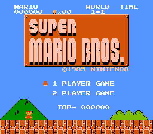

# Analyse des vidéos

Ce programme va venir analyser plusieurs vidéos, afin d'en tirer un maximum d'information en faisant de la recherche de sprite, ou "Templates" à l'aide de la fonction "matchTemplate" de la librairie `OpenCV`.

L'obtention de résultats utilisables se fait via deux optimisations principales :
* L'adaptation du "taux de confiance" de nos détections, indiquant à partir de quel seuil de ressemblance on considère que le sprite se trouve dans notre image. Il faut donc trouver des valeurs minimisant nos faux négatifs et faux positifs ;
* La normalisation des images avant détection pour, que celles-ci soient les plus stables possible afin d'obtenir des taux de confiance stable d'une frame/vidéo à l'autre.


## Structure

### [main.py](./main.py)

Point d'entrée du programme, doit être exécuté depuis la [racine du dépôt](../) pour fonctionner correctement du à l'utilisation de chemins relatifs.

### [frame_extractor.py](./frame_extractor.py)

S'occupe de décomposer une vidéo en frame, et les transfert ensuite au script de détection de sprites.

Permet aussi de sauvegarder localement l'entièreté des frames via le booléen `save_frames` si besoin, non pas que ce soit une bonne idée.

### [template_loader.py](./template_loader.py)

Utilitaire qui s'occupe de charger les différents templates depuis [sprite_templates](../ressources/sprite_templates/) et d'y ajouter des données utiles pour certains comme le taux de confiance souhaité.

### [sprite_detector](./sprite_detector.py)

Élément central de notre programme, qui va venir prendre nos frames, les normaliser, puis effectuer la recherche de nos templates dessus.

Pour la normalisation, celle-ci sera calibrée pour une vidéo après détection du menu principal.
Le programme sera alors capable de retirer manuellement les bordures noires/sombres pour les frames suivantes s'il y en a.
Il est donc nécessaire que les vidéos montrent le menu principal avant de lancer le jeu



## Utilisation

### Entrée

Les vidéos à analyser doivent être placées dans [ressources/videos](../ressources/videos). De par la sensibilité de l'algorithme de détection, celles-ci doivent respecter un certain nombre de contraintes pour une analyse optimale :

* .mp4 avec un encodage h264 ;
* Très peu ou pas compréssées (celles utilisées pour obtenir nos données ont été enregistrées avec ffmpeg et un Constant Rate Factor de 1) ;
* 60 fps ;
* Utilise la palette de couleur PAL et non NTSC (couleurs plus saturées que nos templates) ;
* Inclut le menu principal du jeu avant toute séquence à analyser (pas nécessairement dès la première frame) ;
* N'est pas coupées verticalement (on doit voir deux blocs de sol complets en dessous de mario) ;
* Ne possède que des bordures noires/sombres autout de l'écran de jeu, sinon aucune.

Les vidéos utilisées pour obtenir nos données actuelles peuvent être téléchargées [ici](https://mega.nz/file/ZOIEDayb#gDtLxSGH6Reeb79w4EnQjvNVOKiJ0mBrTzWVsI02k0E) (archive Zip d'environ 700 Mo).

### Lancement

Toutes les commandes indiquées ici doivent être lancées depuis la [racine du dépôt](../).

Si ce n'est pas encore fait, mettez en place un environement virtuel python local pour y installer toutes les dépendances utilisées à travers le dépot :

```bash
python3 -m venv .venv
source .venv/bin/activate
pip install --upgrade pip
pip install -r requirements.txt
```

Pour les fois suivantes, seule la commande `source .venv/bin/activate` sera nécessaire pour réactiver l'environnement virtuel.

Ensuite, lancez le programme avec la commande suivante :

```bash
.venv/bin/python ./src/main.py
```

### Sortie

4 fichiers csv seront créés dans [data](../data/) :

* videos.csv : Associe à chaque vidéo un identifiant
* levels.csv : Enregistre les changements de niveau dans lequel se situe le joueur
* death.csv : Enregistre les morts de mario et la catégorie (ennemi ou chute)
* events.csv : Enregistre tous les autres évènements actuellement recherchés (sauts, mort d'un goomba/koopa, apparition de power-ups, et pièce obtenue d'un bloc `?`).

Hormis le premier fichier, la frame à laquelle un évènement se produit au sein d'une vidéo ainsi que l'identifiant de la vidéo sont également sauvegés.

Si les fichiers existent déjà, ils seront réinitialisés.

## Pistes d'améliorations

### Normalisation

La normalisation peut être améliorée de plusieurs afin de permettre un format de vidéos moins stricte tout en gardant/améliorant l'image normalisée pour la détection:

* Prise en charge du format verticalement limité (lorsque le deuxième bloc de sol en dessous de Mario n'est pas complètement visible) en détectant le format utilisé afin de crop les frames en conséquence ;
* Mettre en place une palette de couleurs acceptées, chaque pixel de nos frame après réduction de la taille serait alors ramené vers la couleur de notre palette la plus proche, afin de combattre la compression vidéo. Pourrait également être utilisé pour transposer les vidéos avec la palette NTSC vers la palette PAL. (probablement très couteux en ressources)

### Détection

Outre l'ajout de nouveaux éléments à détecter, de nombreux points pourraient être améliorés, notamment pour gagner en performances :

* Limitation du nombre de templates recherchés par frame :
    * Garder un tableau indiquant quels niveaux peuvent être atteints depuis le niveau actuel, afin de ne rechercher que ces numéros de niveaux ;
    * Certains sprites n'existent que pour certains types de niveaux (les Goomba bleus ne sont que dans les souterrains), et certain templates pourraient donc être ignorés en fonction du niveau actuel ;
* Utilisation du GPU :
    * matchTemplate utilise un algorithme de recherche naif, en essayant de placer le template sur chaque position possible de notre frame afin de calculer un taux de ressemblance, très couteux en temps CPU, mais parfait pour un GPU bien que nettement plus difficile à mettre en place proprement ;
* Suppression du cooldown pour nos templates :
    * Actuellement, pour la plupart des évènements, un cooldown (nombre de frame) est mis en place pendant lequel on ne cherche pas à détecter cet évènement. Cela évite de compter le même saut deux fois, mais peut avoir l'effet inverse ou deux petits sauts ne comptent que pour un ;
    * On pourrait à la place chercher à détecter ce sprite en continu jusqu'à sa disparition, avant de pouvoir recompter cet évènement (ne marche que pour les sprites n'apparaissant qu'une fois à l'écran pour une frame donnée)

### Autres

* Remplacement de l'unité de mesure du temps pour les cooldown de la frame vers la seconde, afin de supporter des vidéos avec différents FPS